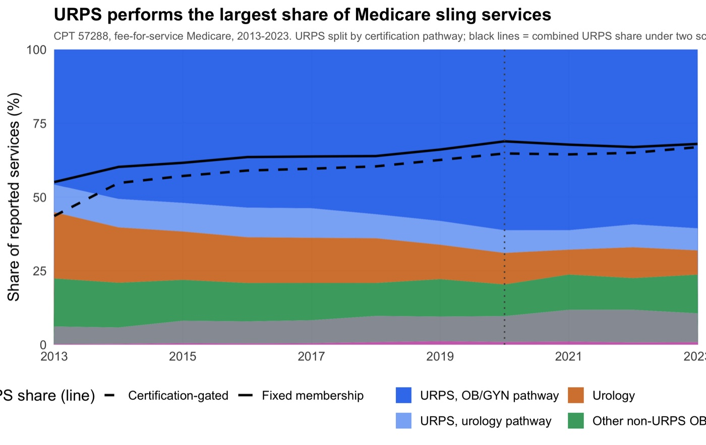
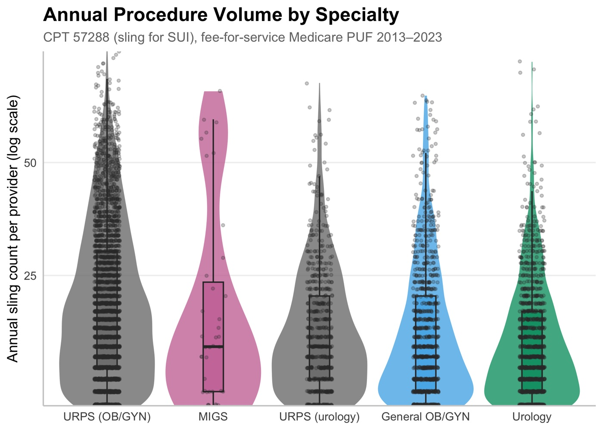
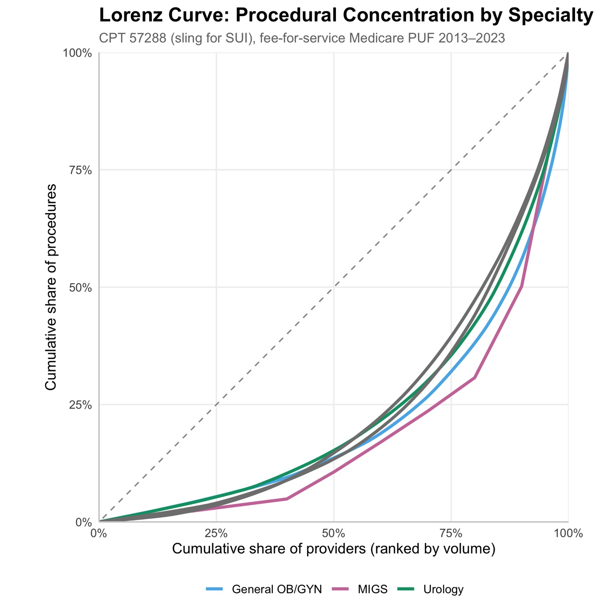
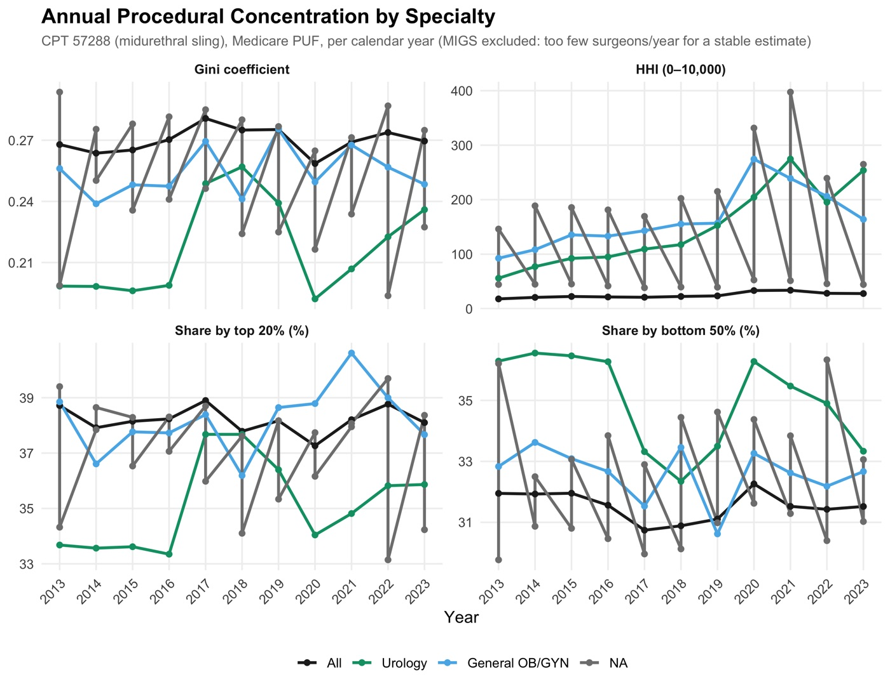
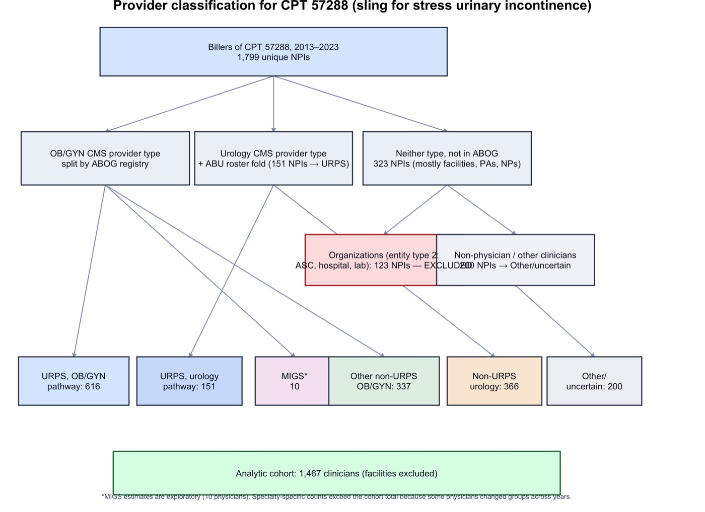

# Sling Surgery for Stress Urinary Incontinence in Fee-for-Service Medicare

**Specialty Distribution and Surgeon-Level Concentration of Sling Surgery for Stress Urinary Incontinence in Fee-for-Service Medicare, 2013–2023** (CPT 57288)

Authors: Tyler Muffly, MD

Target venue: *Urogynecology* (AUGS, American Urogynecologic Society)
Status: In preparation

---

## Abstract

The authoritative, reproducible manuscript (with the current abstract, tables,
figures, and supplementary material) is **`output/manuscript.docx`**, knitted
from `output/manuscript.Rmd`. Every number there is computed from the frozen
cache by `compute_manuscript_values()`, so it never drifts. To avoid maintaining
a second copy that can go stale, the abstract is not duplicated here.

In brief: among physicians billing CPT 57288 (sling surgery for stress urinary
incontinence) in fee-for-service Medicare, 2013-2023, all-pathway URPS
physicians (identified through both certification pathways)
performed most operations and their share rose over the decade. Raw service
counts fell, but after adjusting for the shrinking female Part B fee-for-service
population the utilization rate declined only modestly and its trend was not
statistically significant. Within-year surgeon-level concentration was low,
stable, and similar across the well-populated specialties. Findings describe the
observable fee-for-service workforce, not the entire national sling market.

---

## Figures

These are web-sized copies in `docs/figures/`, committed so they render here.
The print-resolution originals are written to `output/figures/` by pipeline
steps 07 and the standalone scripts, and that directory is not tracked in git.
Numbers are deliberately not repeated in the captions; the manuscript tables
are the single source of truth.

### 1. Market share of CPT 57288 by specialty, 2013–2023



URPS physicians, identified through either the OB/GYN or urology certification pathway, performed the majority of observable services, and their combined share rose over the decade. OB/GYN-pathway URPS was the largest single group and increased the most; urology-pathway URPS changed comparatively little. Non-URPS urology and other non-URPS OB/GYN declined, and MIGS contributed under 1% throughout. Exact shares and trends are in the manuscript (Table 1).

### 2. Annual procedure volume distribution by specialty



Violin plots with embedded box plots and jittered individual observations show the annual volume distribution on a log scale, by specialty group. All groups are right-skewed with outlier high-volume providers, and OB/GYN-pathway URPS carries the highest median. The floor at 11 is an artifact of CMS suppressing records for clinicians treating fewer than 11 beneficiaries, not a real minimum.

### 3. Lorenz curves of procedural concentration by specialty



The dashed diagonal represents perfect equality, where each surgeon performs an equal share of procedures; curves farther from the diagonal indicate greater concentration. Concentration was low and broadly similar across the well-populated specialty groups. Because CMS suppresses low-volume physician-years, these curves describe observable services and do not identify full-market concentration.

### 4. Annual concentration measures by specialty



Gini, HHI, top-20% share and bottom-50% share computed *within each calendar year* and regressed on year. This is the panel that answers the question a single pooled Gini cannot: whether sling surgery concentrated into fewer hands over the decade. It did not. Within-year concentration was low and flat throughout, which is why the pooled multi-year Gini (higher, because it also absorbs how many years each surgeon stayed observable) is reported as secondary.

### 5. Specialty classification flow



How raw CPT 57288 billers become the five analyzed physician groups: organizational NPIs (NPPES entity type 2) and unclassifiable billers are removed, CMS provider type is cross-referenced against the subspecialty certification rosters, and URPS is split by certification pathway. Worth reading before any other figure, because every downstream number depends on these choices, and the alternative handling of ambiguous billers is a sensitivity analysis rather than the primary cohort.

---

## Key Findings

The primary cohort is identified physicians only: organizational NPIs (NPPES entity type 2) and unclassifiable billers are excluded, and remaining physicians are split into five mutually exclusive groups (URPS OB/GYN pathway, URPS urology pathway, non-URPS urology, other non-URPS OB/GYN, MIGS). The authoritative per-group counts, service totals, shares, medians, and trends live in the manuscript **Table 1** and are computed from the frozen cache by `compute_manuscript_values()`; they are deliberately not duplicated here.

- **URPS physicians (both certification pathways) performed the majority of observable services**, and their combined share rose across 2013-2023 (significant trend); the increase was driven mainly by the OB/GYN pathway.
- **The Other/uncertain and facility billers are a sensitivity, not the primary cohort.** Assigning ambiguous billers to urology (the legacy approach) roughly doubles the apparent non-URPS urology share (Supplementary Table S11).
- CMS cell suppression (<11 beneficiaries) means all observable providers bill at least 11 slings, so true low-volume providers are invisible and full-market concentration is not identified.

---

## How to Run

```bash
# From the project root:

# First time (or returning after months): restore exact R package versions
Rscript -e 'renv::restore()'

# Run the full pipeline
Rscript 00_run_all.R
```

### Reproducible environment

This project uses [`renv`](https://rstudio.github.io/renv/) to lock R package versions. The `renv.lock` file pins 128 packages to the exact versions used for the analysis (R 4.4.0). When returning to this project:

1. `renv::restore()` — installs all packages at the locked versions
2. `renv::status()` — checks if anything has drifted
3. `renv::snapshot()` — updates the lockfile if you add new packages

### Pipeline steps

All parameters are in `config.yml`. The pipeline runs 10 steps:

1. **01_build_puf_cache.R** — Read raw CMS PUF CSVs, filter to CPT 57288, merge across years
2. **02_classify_specialties.R** — Classify providers by CMS provider type
3. **03_run_primary_analysis.R** — Split OB/GYN into URPS/MIGS/General using the subspecialty certification registry, compute Gini and concentration metrics, exclude "Other" group
4. **03_run_primary_analysis_sens.R** — Sensitivity: alternative specialty groupings (gynecologic-merged, binary URPS/non-URPS)
5. **04_run_sensitivity_analyses.R** — Cross-sectional vs multi-year Gini comparison
6. **05_generate_abstract.R** — Programmatic abstract with all statistics computed from data
7. **06_make_tables.R** — Publication tables (CSV + HTML), incl. Table 5 (annual concentration) and Table 6 (year trends)
8. **07_make_figures.R** — Market share trend, volume distributions, Lorenz curves, plus Figure 4 (annual concentration) and Figure 5 (supply trends)
9. **07b_make_manuscript_figures.R** — The six manuscript figures (`sling_figures_1_to_6.R`): stacked specialty share with the two URPS bounds, workforce/volume panels, volume raincloud, physician-level Lorenz curves, state URPS-share map, and entrant-vs-exit diverging bars. Runs alongside step 07 (needs `ggdist`/`patchwork`/`sf`/`tigris`; skips gracefully if absent)
10. **08_render_manuscript.R** — Render `output/manuscript.Rmd` to `output/manuscript.docx`. The Rmd computes every number inline from the cache via `compute_manuscript_values()`, so prose and analysis never drift

### Output files

| File | Description |
|------|-------------|
| `output/abstract.txt` | Programmatic abstract (420 words) |
| `output/tables/table_1_specialty_summary.csv` | Specialty-level summary; Gini here is across physician-YEAR volumes |
| `output/tables/table_2_concentration.csv` | Concentration metrics; Gini here is across physicians on AGGREGATE volume, so it runs higher than Table 1 |
| `output/tables/table_3_time_trends.csv` | Annual trends by specialty |
| `output/tables/table_4_stats.csv` | Statistical tests (Kruskal-Wallis, Wilcoxon, trend) |
| `output/tables/table_5_annual_concentration.csv` | Per-year × specialty concentration (surgeons, procedures, median[p25–p75], Gini, HHI, top-10/20%, bottom-50%) |
| `output/tables/table_6_concentration_trends.csv` | OLS trend of each annual measure on calendar year, by specialty |
| `output/tables/table_s1_sensitivity.csv` | Cross-sectional vs multi-year sensitivity |
| `output/figures/figure_1_market_share.png` | Market share time trend |
| `output/figures/figure_2_volume_distribution.png` | Volume distributions (violin + box) |
| `output/figures/figure_3_lorenz_curve.png` | Lorenz curves by specialty |
| `output/figures/figure_4_concentration_trends.png` | Annual Gini/HHI/top-20%/bottom-50% by specialty over time |
| `output/figures/figure_5_supply_trends.png` | Observable surgeons and procedure volume per year by specialty |
| `output/tables/table_8_volume_gee.csv` (+ `8b`, NB mixed) | Repeated-measures rate ratios (GEE / NB mixed), 2020 sensitivity |
| `output/tables/table_9_per_physician.csv` | One-value-per-physician secondary tests |
| `output/tables/table_10_classification_sensitivity.csv` (+ `10b`) | Time-varying vs modal vs ever-URPS/MIGS distribution & trends |
| `output/tables/table_11_workforce_dynamics.csv` (+ `11b` by specialty) | Annual entrant/continuing/exiting surgeons (2-yr washout) |
| `output/tables/table_12_specialty_share_trends.csv` | Per-specialty annual market-share trends |
| `output/tables/table_13_geography_by_state.csv` | State-level observable surgeons & URPS share |
| `output/manuscript.Rmd` | **Reproducible manuscript source**: every number is delivered inline from the cache via `compute_manuscript_values()` (no hardcoded values) |
| `output/manuscript.docx` | Manuscript rendered from `manuscript.Rmd` by pipeline step 08 |
| `output/manuscript.md` | Static markdown copy of the manuscript (superseded by the Rmd; kept for reference) |

---

## Data Sources

- **CMS Medicare Physician & Other Practitioners PUF** (2013–2023): Provider-and-service level claims data. Raw CSVs (~2.7GB each) in `data/raw/`, downloaded from [data.cms.gov](https://data.cms.gov/provider-summary-by-type-of-service/medicare-physician-other-practitioners/medicare-physician-other-practitioners-by-provider-and-service). Not tracked in git.
- **Subspecialty certification registry**: `data/canonical_abog/canonical_abog_npi_LATEST.csv` — NPI-to-subspecialty crosswalk from the subspecialty certification registry. Used to split OB/GYN providers into URPS, MIGS, and General OB/GYN.
- **Urology-pathway URPS certification roster**: `data/abu_urology/abu_urps_npi_LATEST.csv` — NPIs of fellowship-trained URPS surgeons who entered via a urology residency (the urology certifying board), sourced from the `isochrones` the urology-pathway certification roster pipeline. The CMS PUF reports these surgeons only as "Urology"; cross-referencing this list folds them into the combined URPS group (config key `urps_urology_npi_csv`; set to empty/remove to keep them in Urology).

---

## Design Decisions (for returning to this project)

1. **Why Gini instead of low-volume thresholds?** CMS suppresses provider-level data when <11 beneficiaries are served. With a low-volume threshold of 10, no providers can be classified as low-volume because they're already removed from the PUF. Gini coefficients and top-N% shares measure concentration within the observable distribution.

2. **Why split OB/GYN?** The the certification crosswalk revealed that 78% of OB/GYN sling providers are URPS subspecialists. Lumping them together masks a major difference between fellowship-trained urogynecologists and generalists.

3. **Why exclude "Other"?** `config.yml: other_handling` is `"exclude"`, so the primary cohort is identified physicians only: organizational NPIs (NPPES entity type 2) and billers whose specialty cannot be determined are dropped rather than carried as a sixth group. This makes the five physician groups partition the cohort, so their shares sum to 100%. The inclusive handling (`"separate"`, which retains an Other/uncertain group) is preserved as a sensitivity analysis in Supplementary Table S11, alongside the legacy approach of assigning ambiguous billers to urology. Switching the config key regenerates every downstream number, and the test suite asserts the group set matches the configured mode.

4. **Why 2013 start?** CMS PUF begins in 2013. The 2012 data was published in an earlier format that has been superseded. Extending from 2017–2023 to 2013–2023 made the gynecologic market share trend statistically significant (p=0.10 → p<0.001).

5. **FPMRS → URPS rename:** The subspecialty was renamed from "Female Pelvic Medicine and Reconstructive Surgery" to "Urogynecology and Reconstructive Pelvic Surgery" by ABMS. The code uses "URPS" throughout.

6. **Combined URPS (both training pathways):** URPS is certifiable from either an OB/GYN or a urology residency. The the subspecialty certification registry captures only the OB/GYN pathway; urology-pathway URPS surgeons appear as "Urology" in the CMS PUF. Step 2c of `analyze_midurethral_sling_patterns()` cross-references the urology-pathway certification roster (`urps_urology_npi_csv`) and promotes those NPIs into a single combined URPS group, leaving Urology as non-URPS urology. Note: this makes "URPS + MIGS + General OB/GYN" no longer purely OB/GYN-trained, so revisit any "gynecologic share" wording.

7. **Annual concentration, not just one pooled Gini:** `build_annual_concentration_metrics()` computes every concentration measure per calendar year (overall and by specialty) — total procedures, observable surgeons, median[p25–p75], Gini, HHI, top-10/20% and bottom-50% shares — and `build_concentration_trend_regressions()` regresses each on year. This distinguishes *within-year* concentration (was ~0.27 and stable) from cumulative *multi-year* concentration (~0.52), answering whether care concentrated over time rather than reporting a single pooled value. Refresh from the cached `provider_volume`/`puf_classified` without re-reading raw CSVs via `scripts/refresh_annual_concentration.R`.

8. **Gini AND HHI, both surgeon-level:** the concentration table reports the Herfindahl–Hirschman Index next to Gini (`compute_hhi()`). They answer related but distinct questions — Gini = inequality across the whole surgeon-volume distribution; HHI = concentration driven especially by the largest-volume surgeons. Each physician is the production unit: this is **surgeon-level procedural concentration, not antitrust hospital/market competition**, and values are not comparable to FTC/DOJ thresholds.

9. **Repeated-measures volume models (`R/volume_models.R`):** provider-year rows are not independent (each NPI recurs across years), so the Kruskal-Wallis/pairwise-Wilcoxon tests are descriptive only. `fit_volume_nb_mixed()` (negative-binomial mixed model, random intercept per NPI, via glmmTMB) and `fit_volume_gee()` (Poisson GEE clustered by NPI, via geepack) give adjusted rate ratios with 95% CIs for specialty, calendar year, specialty × year, and a 2020/COVID indicator; `test_per_physician_volume()` is the one-value-per-physician secondary. Run `scripts/fit_volume_models.R`. glmmTMB/geepack are optional (functions skip gracefully if absent). glmmTMB needs OpenMP-linked TMB — on macOS install `libomp` if it fails to load; the GEE path has no such requirement.

10. **Specialty-classification sensitivity (`R/classification_schemes.R`):** because the headline concerns *changes* in specialty market share, `assign_specialty_scheme()` supports three assignments — `time_varying` (one specialty per physician-year; the primary, already time-varying at the CMS level), `modal` (single most-frequent specialty per physician), and `ever_urps_migs` (URPS if ever URPS, else MIGS if ever MIGS, else modal). `scripts/classification_sensitivity.R` compares the specialty distribution and market-share trends across all three. **Result:** distribution differs by <1 percentage point and the URPS/gynecologic share trend stays significant in every scheme (URPS +0.90 to +0.98 pp/yr, all p ≤ 0.001), so the conclusion is robust to classification.

    A fully time-varying subspecialty hierarchy (registry URPS active by year → registry MIGS active by year → CMS urology → CMS general OB/GYN) is implemented in `assign_time_varying_certgated()`: pass an `npi → subspecialty → cert_year` table and each physician is assigned URPS/MIGS only from their certification year onward. The certification years come from the subspecialty certification registry **the subspecialty certification start-date field** field — the true FPMRS/MIG subspecialty certification date (range 2013–2024, none before 2011), distinct from the initial OB/GYN/urology board date (`startdate`). `scripts/build_abog_certyear_crosswalk.R` derives `data/canonical_abog/abog_subspecialty_certyear_LATEST.csv` (config `abog_subspecialty_certyear_csv`), and `scripts/classification_sensitivity.R` adds the cert-gated scheme as a fourth arm. **Result — the two schemes bracket the rate of increase (computed on a common denominator):** fixed membership (retroactively counting each physician as URPS in all years) gives the shallower slope, URPS 53.4% → 63.8% (+0.90 pp/yr); time-varying cert-gating gives the steeper slope, URPS 42.2% → 62.8% (+1.54 pp/yr, p < 0.001), because it removes not-yet-certified physicians from the early URPS count (board certification lags practice onset: the 2013 inaugural exam certified an already-practicing cohort; later diplomates practiced before boarding). The two estimates converge near 63% by 2023, so the bracket is on the slope (~+0.9 to ~+1.5 pp/yr), not the endpoint. Both schemes require the same cohort denominator; computing the cert-gated share on a smaller (Other-excluded) base spuriously inflates it. A point estimate would need fellowship-completion dates (unavailable). Caveats: ~8% of URPS unmatched to a cert year and urology-pathway URPS held fixed.

11. **Workforce entry/continuation/exit (`R/workforce_dynamics.R`):** `build_workforce_dynamics()` classifies each observable surgeon per year, using a two-year washout, as entrant (absent both prior observable years), continuing, or apparently exiting (absent both subsequent observable years), plus the entrant volume share, median entrant volume, and entrants by specialty. Because CMS suppresses <11-beneficiary providers, these are *newly observable* surgeons, not definitively new. Result: URPS contributed the most entrants (440) but urology showed heavy churn (373 entrants despite a net decline); entrants performed 7–23% of annual volume at low median (~13). `scripts/workforce_and_geography.R`.

12. **Specialty-specific market-share trends:** each specialty's annual share is regressed on year separately (not only the combined gynecologic figure): URPS +0.90 pp/yr (p<0.001), urology −0.55 (p=0.004), General OB/GYN −0.42 (p=0.006), MIGS +0.07 descriptive (n=10). Total observable volume did not grow — the change is specialty ownership, not volume growth.

13. **Geography (secondary, `scripts/workforce_and_geography.R`):** state-level observable-surgeon counts and URPS share by provider practice state, and the suppression-respecting question "which states have no observable URPS surgeon performing ≥11 Medicare slings in any year" (North Dakota, Alaska, Puerto Rico, Wyoming). Per-capita rates and maps are deliberately deferred — they need female Medicare fee-for-service denominators with Medicare Advantage adjustment, proposed as a separate access paper.

14. **Reproducible manuscript with inline data (`output/manuscript.Rmd`, `R/compute_manuscript_values.R`):** the manuscript is knitted, not hand-typed. `compute_manuscript_values()` reads the frozen `puf_classified` cache and returns one list holding every scalar and every table (~120 values); the Rmd references them with inline `` `r v$...` `` expressions and renders the five tables with `knitr::kable`. Pipeline step 08 renders it to docx. Because the numbers come from the analysis rather than being typed in, the prose can never drift from the data (running `analyze_*()` differently updates the manuscript automatically). To render ad hoc: `Rscript -e 'rmarkdown::render("output/manuscript.Rmd", knit_root_dir=getwd())'` (set the `PUF_CLASSIFIED` env var to point at a cache elsewhere).

15. **2017 was truncated, then fixed (`config.yml: exclude_years`):** the original raw D17 PUF download was truncated (1.5 GB vs the ~2.7 GB expected, cut mid-record, ~376 sling provider-rows instead of the true 745), so 2017 was temporarily set in `exclude_years` and every figure/table skipped it. The complete 2017 file was re-downloaded (full 3.0 GB CSV, 745 CPT 57288 provider-rows / ~16,200 procedures), verified against the schema, and merged into `puf_classified.rds`; the truncated raw file was replaced on disk (backup kept as `*.truncated_backup`). `exclude_years` is now `[]` and all 11 years (2013–2023) are analyzed. The final cohort is 1,467 physicians, 129,517 services, 6,056 physician-years. Lesson: after any bulk CMS download, sanity-check each year's file size and CPT-of-interest row count before caching.

---

## Project Structure

```
sling-volume-patterns/
├── 00_run_all.R                    # Master pipeline orchestration
├── config.yml                      # All parameters (years, cutoffs, paths)
├── R/
│   ├── 01_build_puf_cache.R        # Step 1: Read/merge PUF CSVs
│   ├── 02_classify_specialties.R   # Step 2: CMS provider type classification
│   ├── 03_run_primary_analysis.R   # Step 3: the subspecialty certification registry split + concentration analysis
│   ├── 03_run_primary_analysis_sens.R  # Step 3s: Sensitivity specialty schemes
│   ├── 04_run_sensitivity_analyses.R   # Step 4: Cross-sectional vs multi-year
│   ├── 05_generate_abstract.R      # Step 5: Programmatic abstract
│   ├── 06_make_tables.R            # Step 6: Publication tables
│   ├── 07_make_figures.R           # Step 7: Publication figures
│   ├── analyze_sling_patterns.R    # Core analysis functions (Gini, classification)
│   ├── generate_sling_abstract.R   # Abstract section builders
│   ├── reporting_stats_helpers.R   # Statistical test helpers
│   └── artifact_manifest.R         # Reproducibility/caching system
├── scripts/                        # Standalone analyses NOT in 00_run_all.R
│   ├── make_market_share_figure.R      # -> figure_market_share.png
│   ├── make_rate_figure.R              # -> figure_rate_per_100k.png
│   ├── make_classification_flow.R      # -> figure_classification_flow.png
│   ├── fit_volume_models.R             # GEE / NB mixed volume models
│   ├── classification_sensitivity.R    # Four classification schemes
│   └── workforce_and_geography.R       # Entry/exit, state-level shares
├── templates/
│   └── urogynecology_reference.docx # Double spacing + line numbers for LWW
├── tests/testthat/                 # 215 tests, incl. golden-value assertions
├── docs/figures/                   # Web-sized JPEGs for this README (tracked)
├── data/
│   ├── raw/                        # Original CMS CSVs (not in git)
│   ├── cache/                      # Pipeline artifacts (.rds)
│   ├── canonical_abog/             # certification NPI crosswalk
│   ├── abu_urology/                # Urology-pathway URPS certification roster
│   └── denominator/                # Female Part B FFS enrollment
└── output/                         # NOT tracked in git, except manuscript.*
    ├── abstract.txt / .docx        # Generated abstract
    ├── manuscript.Rmd / .docx      # Reproducible manuscript
    ├── tables/                     # CSV + HTML tables
    └── figures/                    # Print-resolution PNG + JPEG
```

> **Three manuscript figures come from `scripts/`, not from the pipeline.**
> `manuscript.Rmd` embeds `figure_market_share`, `figure_rate_per_100k` and
> `figure_classification_flow`, which no numbered step produces. Running
> `00_run_all.R` alone therefore renders a manuscript missing three figures,
> and it does so silently, because `show_fig()` degrades to a "Figure not
> found" note rather than failing. Run those three scripts before step 08.

---

## R Dependencies

Core: [`dplyr`](https://dplyr.tidyverse.org/), [`readr`](https://readr.tidyverse.org/),
[`purrr`](https://purrr.tidyverse.org/), [`tibble`](https://tibble.tidyverse.org/),
[`stringr`](https://stringr.tidyverse.org/), [`glue`](https://glue.tidyverse.org/),
[`rlang`](https://rlang.r-lib.org/), [`vroom`](https://vroom.r-lib.org/),
[`furrr`](https://furrr.futureverse.org/) / [`future`](https://future.futureverse.org/),
[`config`](https://rstudio.github.io/config/), [`here`](https://here.r-lib.org/),
[`assertthat`](https://github.com/hadley/assertthat).

Reporting: [`ggplot2`](https://ggplot2.tidyverse.org/),
[`scales`](https://scales.r-lib.org/), [`kableExtra`](https://haozhu233.github.io/kableExtra/),
[`knitr`](https://yihui.org/knitr/), [`rmarkdown`](https://rmarkdown.rstudio.com/),
[`broom`](https://broom.tidymodels.org/).

Models (optional; the pipeline skips gracefully if absent):
[`glmmTMB`](https://cran.r-project.org/package=glmmTMB),
[`geepack`](https://cran.r-project.org/package=geepack),
[`TMB`](https://cran.r-project.org/package=TMB).

The authoritative list is [`renv.lock`](renv.lock), which pins 128 packages
against R 4.4.0. Do not install from this section; run `renv::restore()`.

> **A cold restore needs a Fortran compiler.** `RcppArmadillo`, `lme4`,
> `Matrix`, `TMB`, `mgcv`, `nlme` and `fracdiff` all build from source and link
> against Fortran. Without gfortran the link fails and renv aborts the whole
> staged install, leaving an empty library that resembles an unrelated
> cache-wipe failure. Install the
> [official R toolchain build](https://mac.r-project.org/tools/), which unpacks
> to `/opt/gfortran`, the path R's `Makeconf` hardcodes. See `CLAUDE.md` for the
> binary-only workarounds that do not work and why.

---

## References

**Data sources**

- [CMS Medicare Physician & Other Practitioners, by Provider and Service](https://data.cms.gov/provider-summary-by-type-of-service/medicare-physician-other-practitioners/medicare-physician-other-practitioners-by-provider-and-service) — the primary dataset, annual releases 2013-2023.
- [CMS Program Statistics, Medicare enrollment](https://data.cms.gov/summary-statistics-on-beneficiary-enrollment/medicare-and-medicaid-reports/medicare-monthly-enrollment) — female Part B fee-for-service denominators.
- [NPPES NPI Registry](https://nppes.cms.hhs.gov/) — entity type, used to exclude organizational NPIs.
- the obstetrics and gynecology certifying board — OB/GYN-pathway URPS and MIGS subspecialty certification.
- the urology certifying board — urology-pathway URPS certification.

**Standards and methods**

- [STROBE Statement](https://www.strobe-statement.org/) — reporting guideline for observational studies. The completed checklist for this manuscript is [`docs/STROBE_checklist.md`](docs/STROBE_checklist.md); pipeline-adjacent, it renders to `output/STROBE_checklist.docx` for upload with the submission.
- [Gini coefficient](https://en.wikipedia.org/wiki/Gini_coefficient) and [Herfindahl-Hirschman Index](https://www.justice.gov/atr/herfindahl-hirschman-index) — the two concentration measures. Both are computed surgeon-level here and are **not** comparable to antitrust thresholds.
- [AUA/SUFU guideline on surgical treatment of female stress urinary incontinence](https://www.auanet.org/guidelines-and-quality/guidelines) — clinical context.
- [Keep a Changelog](https://keepachangelog.com/en/1.1.0/) and [Citation File Format](https://citation-file-format.github.io/) — formats used by `CHANGELOG.md` and `CITATION.cff`.

**Target venue**

- [*Urogynecology*](https://journals.lww.com/fpmrs/) (Lippincott Williams & Wilkins), official journal of the [American Urogynecologic Society](https://www.augs.org/).

---

## Citing

See [`CITATION.cff`](CITATION.cff). Please cite the manuscript once published;
until then cite this repository.

## License

[MIT](LICENSE) for the code and documentation.

The license does **not** extend to the underlying data. CMS files are public
U.S. government data governed by [their own terms](https://data.cms.gov); the
subspecialty certification rosters are subject to source-specific permissions,
are not redistributable, and are excluded from version control.
